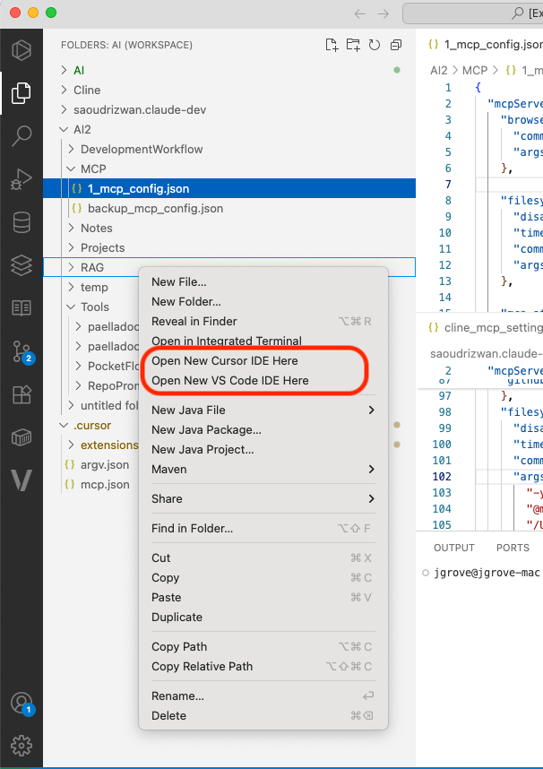

# vscode-open-folder-in-cursor
Adds a context menu to the folders view to open the folder in cursor.  Based on https://github.com/chrisdias/vscode-opennewinstance.

## Features

This extension adds four new context menus to the Explorer:

* **Open New VS Code IDE Here**: Opens a new instance of VS Code scoped to the selected folder OR to the folder containing the selected file.
* **Open New Cursor IDE Here**: Opens a new instance of Cursor scoped to the selected folder OR to the folder containing the selected file.

## Using

Right click on a folder in the Explorer, choose:
* **Open New VS Code IDE Here** 
* **Open New Cursor IDE Here**

## Requirements

The cursor ide must be installed and accessible and in your PATH.

## Extension Settings

none

## Known Issues

none

## Release Notes

### 1.0.0

Initial release of vscode-open-folder-in-cursor.

### 1.0.1

- Changed display name to "Open Folder In Cursor IDE and VS Code IDE"

---

## License

[MIT](LICENSE.md)